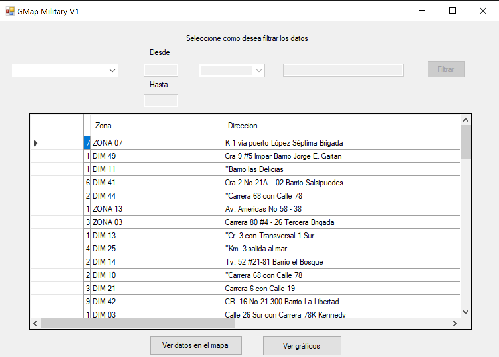
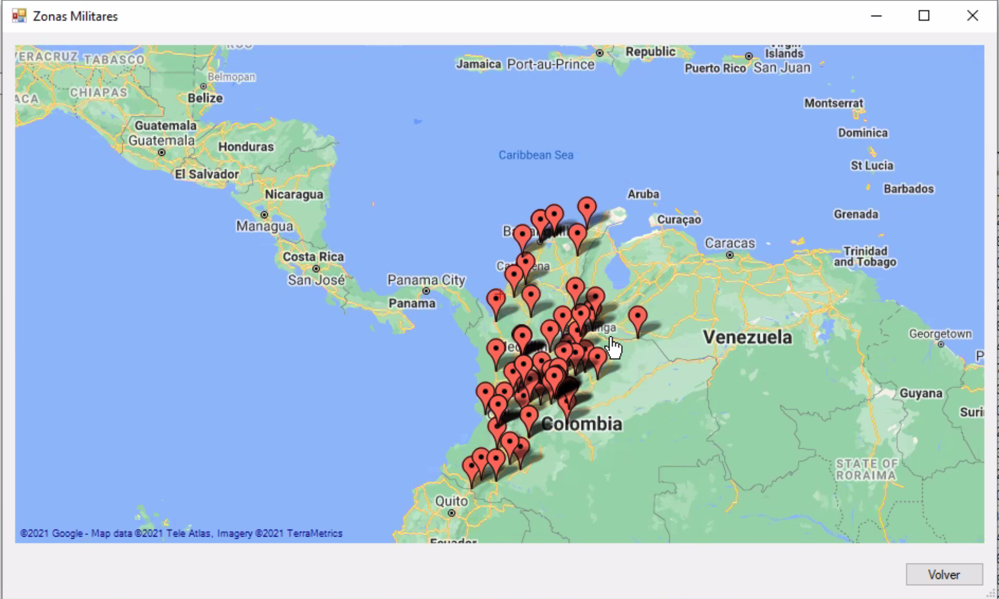
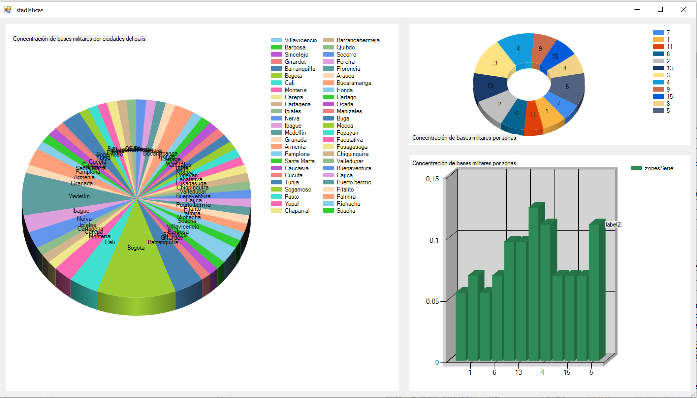
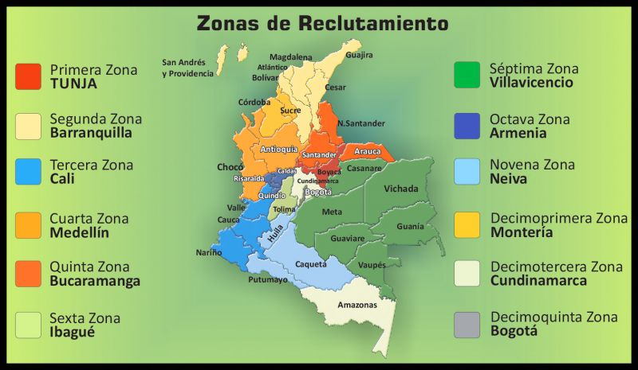

# Gmap Military

ONG peace seeds requieres development of software to facilitate the managemenet of military bases on national territory

# Programming language

The languague used in this program is C#

# Documentation
- Engineering method click [HERE](docs/MetodoDeIngenieria.pdf)
- Documentation click [HERE](docs/Documentation.pdf)

# Demo

Demo video HERE

# Program pictures
- Main interface 

- Map interface

- Graph interface

- Military zones

# Authors 

- [Camilo Cordoba](https://github.com/kamneklogs)
- [Andrea Nuñez](https://github.com/andreanr19)
- [Danna García](https://github.com/Dannasofiagarcia)

